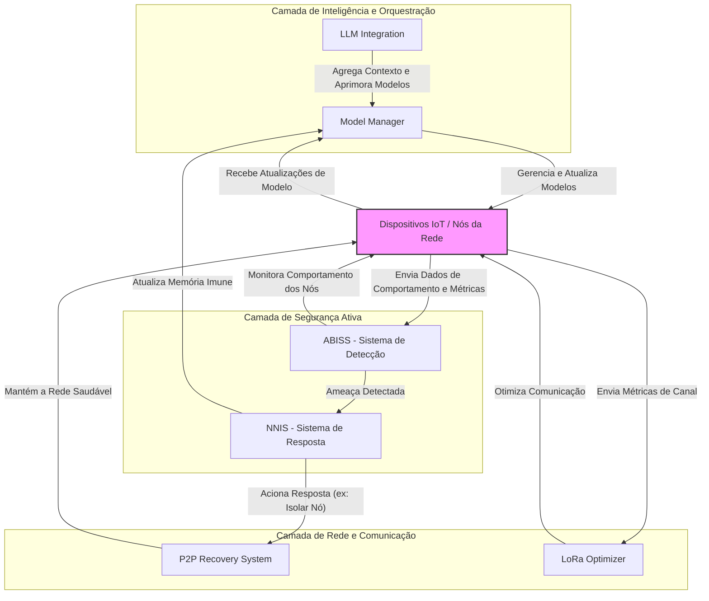
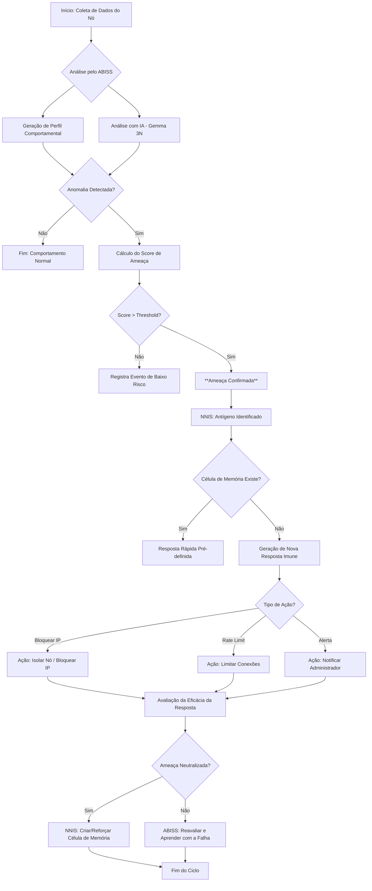
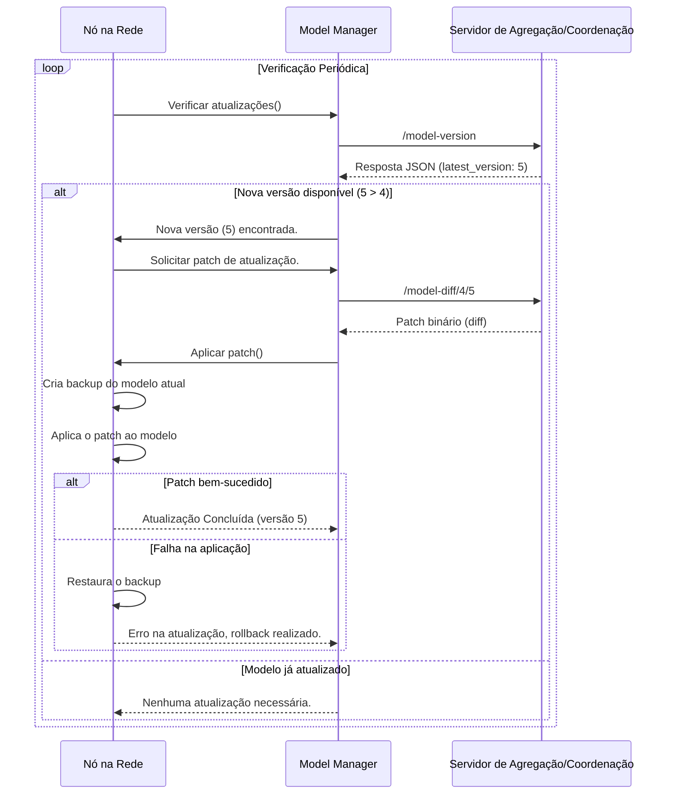
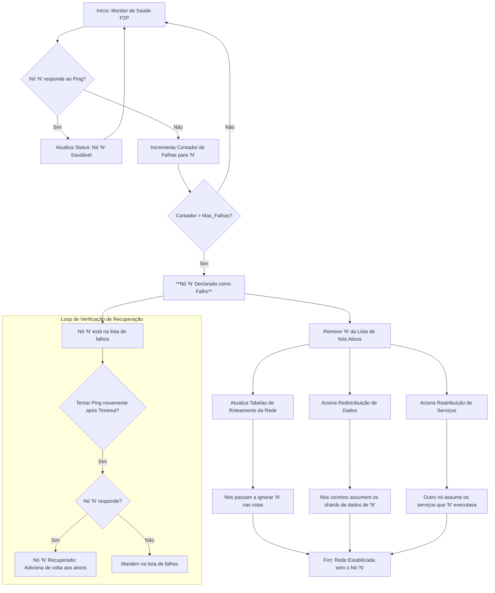
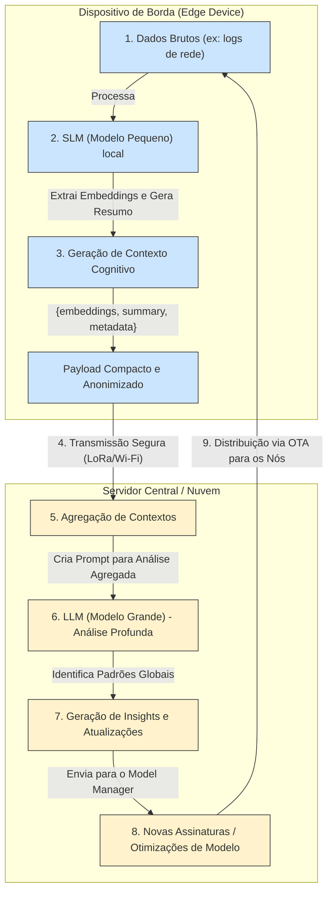

# ATous Secure Network 🛡️

**Uma plataforma de cibersegurança e comunicação autônoma, inteligente e resiliente para o ecossistema de IoT e redes distribuídas.**

📋 [Project Status](PROJECT_STATUS.md) | 📦 [Requirements](requirements.txt) | 📄 [License](LICENSE) | 🧪 [Testing Guide](tests/TESTING_APPROACH.md) | 🔌 [API Contracts](api-contracts.md)

-----

### **Visão Geral**

O **Atous Secure Network** é um framework de última geração que redefine a segurança e a comunicação em redes distribuídas. Projetado com uma abordagem TDD (Test-Driven Development), o sistema integra seis subsistemas sinérgicos para criar uma malha de dispositivos IoT que é:

  - 🧠 **Inteligente**: Utiliza IA e Aprendizado Federado para aprender e se adaptar a novas ameaças.
  - 🛡️ **Segura**: Combina detecção de anomalias comportamentais com um sistema de defesa bio-inspirado.
  - 🔗 **Resiliente**: Garante operação contínua com mecanismos de auto-recuperação (self-healing) em redes P2P.
  - ⚡ **Eficiente**: Otimiza dinamicamente a comunicação sem fio (LoRa) para o equilíbrio ideal entre performance e consumo de energia.

Este projeto não é apenas uma solução de segurança; é uma base para construir aplicações de IoT robustas, autônomas e preparadas para o futuro.

### ✨ **Principais Funcionalidades**

| Funcionalidade | Descrição |
| :--- | :--- |
| **Segurança Adaptativa (ABISS & NNIS)** | Detecção de ameaças em tempo real baseada em comportamento e um sistema de resposta que aprende e evolui, inspirado no sistema imunológico humano. |
| **Comunicação Otimizada (LoRa Optimizer)**| Ajuste dinâmico de parâmetros de redes LoRa para maximizar alcance, velocidade e eficiência energética, com conformidade para múltiplas regiões (BR, EU, US). |
| **Rede Auto-Recuperável (P2P Recovery)** | Detecção e mitigação automática de falhas de nós ("churn"), garantindo que a rede permaneça operacional mesmo com a perda de componentes. |
| **Inteligência Federada (Model Manager)** | Atualizações de modelos de IA de forma segura e distribuída (Over-The-Air) usando patches binários, garantindo privacidade e aprendizado contínuo na borda (Edge AI). |
| **Pipeline Cognitivo (LLM Integration)** | Uma ponte inovadora que permite que modelos de linguagem pequenos (SLM) nos dispositivos enviem "contextos" para um modelo grande (LLM) central, aprimorando a inteligência da rede sem expor dados brutos. |
| **Simulação de Hardware** | Suporte completo a mocks e stubs que permitem o desenvolvimento e teste de todo o sistema em ambientes sem hardware físico (Windows/Linux). |

### 💡 **Potencial de Mercado**

O Atous Secure Network é ideal para setores críticos que demandam alta segurança, resiliência e inteligência:

  - **Indústria 4.0**: Redes de sensores e atuadores em chão de fábrica.
  - **Cidades Inteligentes**: Infraestrutura urbana conectada (iluminação, tráfego, sensores ambientais).
  - **Agronegócio (AgroTech)**: Monitoramento de vastas áreas rurais com conectividade LoRa.
  - **Saúde Conectada (IoMT)**: Dispositivos de monitoramento de pacientes com foco em segurança e privacidade.
  - **Defesa e Segurança**: Redes de comunicação táticas e descentralizadas.

-----

### 🏗️ **Arquitetura e Diagramas do Sistema**

O sistema é construído sobre seis pilares que interagem para entregar uma solução completa e robusta.

#### **Diagrama 1: Arquitetura Geral de Alto Nível**

*Este diagrama mostra a interação sinérgica entre os seis subsistemas principais.*



#### **Diagrama 2: Fluxograma de Detecção e Resposta a Ameaças (ABISS + NNIS)**

*Detalha o processo completo, desde a análise do comportamento de um nó até a resposta imune e o aprendizado.*



#### **Diagrama 3: Diagrama de Sequência da Atualização de Modelo OTA (Model Manager)**

*Ilustra como um nó na rede recebe uma atualização de modelo de forma segura e eficiente.*



#### **Diagrama 4: Fluxograma de Recuperação de Falha de Nó (P2P Recovery)**

*Descreve como o sistema lida com a falha de um nó para manter a rede operacional.*



#### **Diagrama 5: Diagrama de Fluxo de Dados da Pipeline Cognitiva (LLM-SLM) - CORRIGIDO**

*Ilustra a transferência de contexto entre os modelos de linguagem na borda e na nuvem para aprendizado aprimorado.*



-----

### 🚀 **Início Rápido (Getting Started)**

#### **Pré-requisitos**

  - Python 3.8+
  - Git
  - Ambiente virtual (recomendado)

#### **1. Instalação**

```bash
# 1. Clone o repositório
git clone https://github.com/devrodts/Atous-Sec-Network.git
cd Atous-Sec-Network

# 2. Crie e ative o ambiente virtual
# No Windows
python -m venv venv
.\\venv\\Scripts\\Activate.ps1

# No Linux/macOS
python3 -m venv venv
source venv/bin/activate

# 3. Instale as dependências
# Para desenvolvimento em Windows (inclui mocks)
pip install -r requirements-dev-windows.txt

# Para produção ou Linux/Raspberry Pi
pip install -r requirements.txt
```

#### **2. Verificação da Instalação**

Verifique se tudo está configurado corretamente:

```bash
# Verifique problemas de importação
python debug_import.py

# Verifique o status da aplicação
python start_app.py --status
```

#### **3. Executando a Aplicação**

```bash
# Teste rápido (modo leve, sem modelos ML)
python start_app.py --lite

# Aplicação completa (inclui componentes ML)
python start_app.py --full
# ou
python -m atous_sec_network
```

#### **4. Executando os Testes**

Para garantir que tudo está funcionando corretamente:

```bash
# Execute todos os testes
python start_app.py --test
# ou
python -m pytest tests/ -v

# Testes específicos
python -m pytest tests/unit/ -v          # Testes unitários
python -m pytest tests/integration/ -v   # Testes de integração
python -m pytest tests/security/ -v      # Testes de segurança

# Gere um relatório de cobertura de código
python -m pytest --cov=atous_sec_network --cov-report=html
```

#### **5. Modos de Operação**

**Modo Leve** (recomendado para desenvolvimento):
- Inicialização rápida
- Sem carregamento de modelos ML pesados
- Testa funcionalidades básicas
- Perfeito para desenvolvimento e CI/CD

**Modo Completo** (produção):
- Inicialização completa dos modelos ML
- Todos os sistemas de segurança ativos
- Pode demorar no primeiro uso (download de modelos)
- Use para implantação em produção

#### **6. Fluxo de Desenvolvimento**

```bash
# 1. Verifique o ambiente
python debug_import.py

# 2. Execute os testes
python -m pytest tests/ -v

# 3. Teste suas alterações
python start_app.py --lite

# 4. Teste o sistema completo
python start_app.py --full
```

Você deverá ver uma saída indicando que **TODOS OS SISTEMAS ESTÃO OPERACIONAIS**.

### 📚 **Documentação Completa**

#### Links Rápidos
- 🚀 **[Guia do Usuário](docs/USER_GUIDE.md)** - Instruções completas de instalação e uso
- 🛠️ **[Guia de Desenvolvimento](docs/development/README.md)** - Configuração e fluxo de trabalho para desenvolvedores
- 📊 **[Status do Projeto](PROJECT_STATUS.md)** - Status atual de desenvolvimento e resultados de testes
- 📋 **[Contratos da API](api-contracts.md)** - Documentação e contratos da API
- 🧪 **[Guia de Testes](tests/TESTING_APPROACH.md)** - Documentação abrangente de testes

#### Recursos Adicionais
Para mais detalhes sobre cada módulo, configuração e guias de desenvolvimento, consulte a pasta `/docs`:

  - [**Guia de Iniciação**](https://www.google.com/search?q=./docs/getting-started/README.md)
  - [**Arquitetura do Sistema**](https://www.google.com/search?q=./docs/architecture/README.md)
  - [**Documentação da API**](https://www.google.com/search?q=./docs/technical/API_DOCUMENTATION.md)
  - [**Guia de Implantação (Deployment)**](https://www.google.com/search?q=./docs/deployment/README.md)
  - [Requisitos](requirements.txt) - Dependências Python
  - [Licença](LICENSE) - Licença GNU General Public License v3.0
  - [Documentação de Arquitetura](docs/architecture/) - Design e arquitetura do sistema
  - [Guia de Implantação](docs/deployment/) - Instruções de implantação em produção

-----

### 🤝 **Como Contribuir**

Estamos abertos a contribuições\! Se você deseja participar:

1.  Faça um *fork* do repositório.
2.  Crie uma nova *branch* (`git checkout -b feature/sua-feature`).
3.  Desenvolva sua funcionalidade e escreva testes para ela.
4.  Garanta que todos os testes estão passando (`pytest`).
5.  Envie um *Pull Request* detalhado.

### 📄 **Licença**

Este projeto é licenciado sob os termos da licença **GNU General Public License v3.0**. Veja o arquivo [LICENSE](https://www.google.com/search?q=LICENSE) para mais detalhes.

-----

**Criado por Rodolfo Rodrigues - Atous Technology Systems**

*Agradecimentos: A toda família e amigos.*

*Criado com auxílio de múltiplas ferramentas como: Google, Gemini, Claude, Cursor, DeepSeek, e claro o nó humano aqui 🇧🇷*
