# ATous Secure Network 🛡️

**Uma plataforma de cibersegurança e comunicação autônoma, inteligente e resiliente para o ecossistema de IoT e redes distribuídas.**

📋 [Project Status](PROJECT_STATUS.md) | 📦 [Requirements](requirements.txt) | 📄 [License](LICENSE) | 🧪 [Testing Guide](tests/TESTING_APPROACH.md) | 🔌 [API Contracts](api-contracts.md) | 📊 [Security Reports](reports/)

## 🎯 **Status Atual do Sistema**

🟢 **SISTEMA COMPLETAMENTE TESTADO E VALIDADO - 99.7% OPERACIONAL**

- ✅ **354 testes aprovados** de 355 (99.7% de sucesso)
- 🌐 **API Web FastAPI** operacional na porta 8000
- 📊 **Health checks** funcionais para todos os subsistemas
- 📖 **Documentação Swagger** disponível em `/docs`
- 🔒 **Sistemas de Segurança** (ABISS & NNIS) validados
- 🌐 **Sistemas de Rede** (LoRa & P2P) operacionais
- 🧠 **Core Systems** (Model Manager & Logging) configurados
- 🤖 **ML Integration** (Pipeline LLM-SLM) funcional

-----

### **Visão Geral**

O **Atous Secure Network** é um framework de última geração que redefine a segurança e a comunicação em redes distribuídas. Projetado com uma abordagem TDD (Test-Driven Development), o sistema integra seis subsistemas sinérgicos para criar uma malha de dispositivos IoT que é:

  - 🧠 **Inteligente**: Utiliza IA e Aprendizado Federado para aprender e se adaptar a novas ameaças.
  - 🛡️ **Segura**: Combina detecção de anomalias comportamentais com um sistema de defesa bio-inspirado.
  - 🔗 **Resiliente**: Garante operação contínua com mecanismos de auto-recuperação (self-healing) em redes P2P.
  - ⚡ **Eficiente**: Otimiza dinamicamente a comunicação sem fio (LoRa) para o equilíbrio ideal entre performance e consumo de energia.

Este projeto não é apenas uma solução de segurança; é uma base para construir aplicações de IoT robustas, autônomas e preparadas para o futuro.

### ✨ **Principais Funcionalidades**

| Funcionalidade | Descrição |
| :--- | :--- |
| **Segurança Adaptativa (ABISS & NNIS)** | Detecção de ameaças em tempo real baseada em comportamento e um sistema de resposta que aprende e evolui, inspirado no sistema imunológico humano. |
| **Comunicação Otimizada (LoRa Optimizer)**| Ajuste dinâmico de parâmetros de redes LoRa para maximizar alcance, velocidade e eficiência energética, com conformidade para múltiplas regiões (BR, EU, US). |
| **Rede Auto-Recuperável (P2P Recovery)** | Detecção e mitigação automática de falhas de nós ("churn"), garantindo que a rede permaneça operacional mesmo com a perda de componentes. |
| **Inteligência Federada (Model Manager)** | Atualizações de modelos de IA de forma segura e distribuída (Over-The-Air) usando patches binários, garantindo privacidade e aprendizado contínuo na borda (Edge AI). |
| **Pipeline Cognitivo (LLM Integration)** | Uma ponte inovadora que permite que modelos de linguagem pequenos (SLM) nos dispositivos enviem "contextos" para um modelo grande (LLM) central, aprimorando a inteligência da rede sem expor dados brutos. |
| **Simulação de Hardware** | Suporte completo a mocks e stubs que permitem o desenvolvimento e teste de todo o sistema em ambientes sem hardware físico (Windows/Linux). |

### 💡 **Potencial de Mercado**

O Atous Secure Network é ideal para setores críticos que demandam alta segurança, resiliência e inteligência:

  - **Indústria 4.0**: Redes de sensores e atuadores em chão de fábrica.
  - **Cidades Inteligentes**: Infraestrutura urbana conectada (iluminação, tráfego, sensores ambientais).
  - **Agronegócio (AgroTech)**: Monitoramento de vastas áreas rurais com conectividade LoRa.
  - **Saúde Conectada (IoMT)**: Dispositivos de monitoramento de pacientes com foco em segurança e privacidade.
  - **Defesa e Segurança**: Redes de comunicação táticas e descentralizadas.

-----

### 🏗️ **Arquitetura e Diagramas do Sistema**

O sistema é construído sobre seis pilares que interagem para entregar uma solução completa e robusta.

#### **Diagrama 1: Arquitetura Geral de Alto Nível**

*Este diagrama mostra a interação sinérgica entre os seis subsistemas principais.*

```mermaid
graph TD
    subgraph "Camada de Inteligência e Orquestração"
        A[Model Manager]
        B[LLM Integration]
    end

    subgraph "Camada de Segurança Ativa"
        C[ABISS - Sistema de Detecção]
        D[NNIS - Sistema de Resposta]
    end

    subgraph "Camada de Rede e Comunicação"
        E[P2P Recovery System]
        F[LoRa Optimizer]
    end

    G[Dispositivos IoT / Nós da Rede]

    A -- "Gerencia e Atualiza Modelos" --> G
    B -- "Agrega Contexto e Aprimora Modelos" --> A
    C -- "Monitora Comportamento dos Nós" --> G
    C -- "Ameaça Detectada" --> D
    D -- "Aciona Resposta (ex: Isolar Nó)" --> E
    D -- "Atualiza Memória Imune" --> A
    E -- "Mantém a Rede Saudável" --> G
    F -- "Otimiza Comunicação" --> G
    G -- "Envia Dados de Comportamento e Métricas" --> C
    G -- "Envia Métricas de Canal" --> F
    G -- "Recebe Atualizações de Modelo" --> A

    classDef iot fill:#f9f,stroke:#333,stroke-width:2px;
    class G iot;
```



#### **Diagrama 2: Fluxograma de Detecção e Resposta a Ameaças (ABISS + NNIS)**

*Detalha o processo completo, desde a análise do comportamento de um nó até a resposta imune e o aprendizado.*

```mermaid
graph TD
    A[Início: Coleta de Dados do Nó] --> B{Análise pelo ABISS};
    B --> C[Geração de Perfil Comportamental];
    B --> D[Análise com IA - Gemma 3N];
    C --> E{Anomalia Detectada?};
    D --> E;
    E -- "Não" --> F[Fim: Comportamento Normal];
    E -- "Sim" --> G[Cálculo do Score de Ameaça];
    G --> H{Score > Threshold?};
    H -- "Não" --> I[Registra Evento de Baixo Risco];
    H -- "Sim" --> J[**Ameaça Confirmada**];
    J --> K[NNIS: Antígeno Identificado];
    K --> L{Célula de Memória Existe?};
    L -- "Sim" --> M[Resposta Rápida Pré-definida];
    L -- "Não" --> N[Geração de Nova Resposta Imune];
    N --> O{Tipo de Ação?};
    O -- "Bloquear IP" --> P[Ação: Isolar Nó / Bloquear IP];
    O -- "Rate Limit" --> Q[Ação: Limitar Conexões];
    O -- "Alerta" --> R[Ação: Notificar Administrador];
    P --> S[Avaliação da Eficácia da Resposta];
    Q --> S;
    R --> S;
    S --> T{Ameaça Neutralizada?};
    T -- "Sim" --> U[NNIS: Criar/Reforçar Célula de Memória];
    T -- "Não" --> V[ABISS: Reavaliar e Aprender com a Falha];
    U --> W[Fim do Ciclo];
    V --> W;
```



#### **Diagrama 3: Diagrama de Sequência da Atualização de Modelo OTA (Model Manager)**

*Ilustra como um nó na rede recebe uma atualização de modelo de forma segura e eficiente.*

```mermaid
sequenceDiagram
    participant Node as Nó na Rede
    participant MM as Model Manager
    participant Server as Servidor de Agregação/Coordenação

    loop Verificação Periódica
        Node->>MM: Verificar atualizações()
        MM->>Server: /model-version
        Server-->>MM: Resposta JSON (latest_version: 5)
        alt Nova versão disponível (5 > 4)
            MM->>Node: Nova versão (5) encontrada.
            Node->>MM: Solicitar patch de atualização.
            MM->>Server: /model-diff/4/5
            Server-->>MM: Patch binário (diff)
            MM->>Node: Aplicar patch()
            Node->>Node: Cria backup do modelo atual
            Node->>Node: Aplica o patch ao modelo
            alt Patch bem-sucedido
                Node-->>MM: Atualização Concluída (versão 5)
            else Falha na aplicação
                Node->>Node: Restaura o backup
                Node-->>MM: Erro na atualização, rollback realizado.
            end
        else Modelo já atualizado
            MM-->>Node: Nenhuma atualização necessária.
        end
    end
```



#### **Diagrama 4: Fluxograma de Recuperação de Falha de Nó (P2P Recovery)**

*Descreve como o sistema lida com a falha de um nó para manter a rede operacional.*

```mermaid
graph TD
    A[Início: Monitor de Saúde P2P] --> B{Nó 'N' responde ao Ping?};
    B -- "Sim" --> C[Atualiza Status: Nó 'N' Saudável];
    C --> A;
    B -- "Não" --> D[Incrementa Contador de Falhas para 'N'];
    D --> E{Contador > Max_Falhas?};
    E -- "Não" --> A;
    E -- "Sim" --> F[**Nó 'N' Declarado como Falho**];
    F --> G[Remove 'N' da Lista de Nós Ativos];
    G --> H[Aciona Redistribuição de Dados];
    H --> I[Nós vizinhos assumem os shards de dados de 'N'];
    G --> J[Aciona Reatribuição de Serviços];
    J --> K[Outro nó assume os serviços que 'N' executava];
    G --> L[Atualiza Tabelas de Roteamento da Rede];
    L --> M[Nós passam a ignorar 'N' nas rotas];
    M --> N[Fim: Rede Estabilizada sem o Nó 'N'];
    I --> N;
    K --> N;

    subgraph "Loop de Verificação de Recuperação"
        direction LR
        R1[Nó 'N' está na lista de falhos] --> R2{Tentar Ping novamente após Timeout?};
        R2 -- "Sim" --> R3{Nó 'N' responde?};
        R3 -- "Sim" --> R4[Nó 'N' Recuperado: Adiciona de volta aos ativos];
        R3 -- "Não" --> R5[Mantém na lista de falhos];
    end

    F --> R1;
```



#### **Diagrama 5: Diagrama de Fluxo de Dados da Pipeline Cognitiva (LLM-SLM) - CORRIGIDO**

*Ilustra a transferência de contexto entre os modelos de linguagem na borda e na nuvem para aprendizado aprimorado.*

```mermaid
graph TD
    subgraph "Dispositivo de Borda (Edge Device)"
        A["1. Dados Brutos (ex: logs de rede)"]
        B["2. SLM (Modelo Pequeno) local"]
        C["3. Geração de Contexto Cognitivo"]
        D["Payload Compacto e Anonimizado"]
    end

    subgraph "Servidor Central / Nuvem"
        E["5. Agregação de Contextos"]
        F["6. LLM (Modelo Grande) - Análise Profunda"]
        G["7. Geração de Insights e Atualizações"]
        H["8. Novas Assinaturas / Otimizações de Modelo"]
    end

    A -- "Processa" --> B
    B -- "Extrai Embeddings e Gera Resumo" --> C
    C -- "{embeddings, summary, metadata}" --> D
    D -- "4. Transmissão Segura (LoRa/Wi-Fi)" --> E
    E -- "Cria Prompt para Análise Agregada" --> F
    F -- "Identifica Padrões Globais" --> G
    G -- "Envia para o Model Manager" --> H
    H -- "9. Distribuição via OTA para os Nós" --> A

    classDef edge fill:#cce5ff,stroke:#333;
    class A,B,C,D edge;
    classDef cloud fill:#fff2cc,stroke:#333;
    class E,F,G,H cloud;
```



-----

### 🚀 **Início Rápido (Getting Started)**

#### **Pré-requisitos**

  - Python 3.8+
  - Git
  - Ambiente virtual (recomendado)

#### **1. Instalação**

```bash
# 1. Clone o repositório
git clone https://github.com/devrodts/Atous-Sec-Network.git
cd Atous-Sec-Network

# 2. Crie e ative o ambiente virtual
# No Windows
python -m venv venv
.\\venv\\Scripts\\Activate.ps1

# No Linux/macOS
python3 -m venv venv
source venv/bin/activate

# 3. Instale as dependências
# Para desenvolvimento em Windows (inclui mocks)
pip install -r requirements-dev-windows.txt

# Para produção ou Linux/Raspberry Pi
pip install -r requirements.txt
```

#### **2. Verificação da Instalação**

Verifique se tudo está configurado corretamente:

```bash
# Verifique problemas de importação
python debug_import.py

# Verifique o status da aplicação
python start_app.py --status
```

#### **3. Executando a Aplicação**

O ATous Secure Network oferece diferentes modos de execução:

##### **🧪 Modo de Teste (Import Test)**
```bash
# Teste rápido de importação - NÃO inicia servidor
python start_app.py --lite
```
*Este comando apenas testa se os módulos podem ser importados e sai imediatamente.*

##### **🎯 Modo Demonstração (Demo Mode)**
```bash
# Demonstração dos sistemas - NÃO inicia servidor web
python start_app.py --full
# ou
python -m atous_sec_network
```
*Este comando inicializa todos os sistemas, mostra o status e sai. Ideal para verificar se tudo está funcionando.*

##### **🌐 Modo Servidor Web (Production Mode)**
```bash
# INICIA o servidor web FastAPI com todos os endpoints
python start_server.py

# Ou com opções personalizadas
python start_server.py --host 0.0.0.0 --port 8000 --reload

# Ou usando uvicorn diretamente
python -m uvicorn atous_sec_network.api.server:app --host 0.0.0.0 --port 8000 --reload
```

**📡 Após iniciar o servidor, acesse:**
- **API Principal:** http://localhost:8000
- **Documentação:** http://localhost:8000/docs
- **Health Check:** http://localhost:8000/health
- **Status de Segurança:** http://localhost:8000/api/security/status
- **Métricas:** http://localhost:8000/api/metrics

#### **4. Executando os Testes**

Para garantir que tudo está funcionando corretamente:

```bash
# Execute todos os testes
python start_app.py --test
# ou
python -m pytest tests/ -v

# Testes específicos
python -m pytest tests/unit/ -v          # Testes unitários
python -m pytest tests/integration/ -v   # Testes de integração
python -m pytest tests/security/ -v      # Testes de segurança

# Gere um relatório de cobertura de código
python -m pytest --cov=atous_sec_network --cov-report=html
```

#### **5. Modos de Operação Detalhados**

| Modo | Comando | Servidor Web | Descrição | Uso Recomendado |
|------|---------|--------------|-----------|-----------------|
| **🧪 Teste de Importação** | `python start_app.py --lite` | ❌ Não | Testa apenas importações e sai | Verificação rápida, CI/CD |
| **🎯 Demonstração** | `python start_app.py --full` | ❌ Não | Inicializa sistemas e mostra status | Verificação de funcionalidade |
| **🌐 Servidor Web** | `python start_server.py` | ✅ Sim | Inicia FastAPI com todos os endpoints | Desenvolvimento e produção |
| **🔧 Debug** | `python start_app.py --debug` | ❌ Não | Verifica problemas de importação | Troubleshooting |
| **🧪 Testes** | `python start_app.py --test` | ❌ Não | Executa suite de testes | Validação de código |

**⚠️ IMPORTANTE:** Para acessar a API web, WebSockets, endpoints de criptografia e sistemas de segurança, você DEVE usar o **Modo Servidor Web**.

#### **6. Fluxo de Desenvolvimento Recomendado**

```bash
# 1. Verifique o ambiente e dependências
python start_app.py --debug

# 2. Teste importações básicas
python start_app.py --lite

# 3. Execute a suite de testes
python start_app.py --test

# 4. Verifique inicialização dos sistemas
python start_app.py --full

# 5. Inicie o servidor para desenvolvimento
python start_server.py --reload

# 6. Teste os endpoints (em outro terminal)
curl http://localhost:8000/health
curl http://localhost:8000/api/security/status
```

#### **7. Verificação de Funcionalidade Completa**

Para testar todas as funcionalidades do sistema:

```bash
# 1. Inicie o servidor
python start_server.py

# 2. Execute testes de funcionalidade (em outro terminal)
python test_complete_functionality.py

# 3. Teste WebSockets
python test_websocket_fix.py

# 4. Teste segurança
python test_security_final.py
```

Você deverá ver confirmação de que **TODOS OS SISTEMAS ESTÃO OPERACIONAIS** incluindo:
- ✅ API REST endpoints
- ✅ WebSocket connections  
- ✅ Sistemas de segurança ABISS/NNIS
- ✅ Criptografia e autenticação
- ✅ Rate limiting e proteção DDoS

### 📚 **Documentação Completa**

#### 🚨 **IMPORTANTE - Leia Primeiro**
- 🚀 **[Guia de Inicialização](docs/STARTUP_GUIDE.md)** - **COMECE AQUI** - Instruções claras sobre como executar a aplicação

#### Links Rápidos
- 📖 **[Guia do Usuário](docs/USER_GUIDE.md)** - Instruções completas de instalação e uso
- 🏁 **[Getting Started](docs/getting-started/README.md)** - Configuração detalhada e primeiros passos
- 🛠️ **[Guia de Desenvolvimento](docs/development/README.md)** - Configuração e fluxo de trabalho para desenvolvedores
- 📊 **[Status do Projeto](PROJECT_STATUS.md)** - Status atual de desenvolvimento e resultados de testes
- 📋 **[Contratos da API](api-contracts.md)** - Documentação e contratos da API
- 🧪 **[Guia de Testes](tests/TESTING_APPROACH.md)** - Documentação abrangente de testes

#### Recursos Adicionais
Para mais detalhes sobre cada módulo, configuração e guias de desenvolvimento, consulte a pasta `/docs`:

  - [**Guia de Iniciação**](https://www.google.com/search?q=./docs/getting-started/README.md)
  - [**Arquitetura do Sistema**](https://www.google.com/search?q=./docs/architecture/README.md)
  - [**Documentação da API**](https://www.google.com/search?q=./docs/technical/API_DOCUMENTATION.md)
  - [**Guia de Implantação (Deployment)**](https://www.google.com/search?q=./docs/deployment/README.md)
  - [Requisitos](requirements.txt) - Dependências Python
  - [Licença](LICENSE) - Licença GNU General Public License v3.0
  - [Documentação de Arquitetura](docs/architecture/) - Design e arquitetura do sistema
  - [Guia de Implantação](docs/deployment/) - Instruções de implantação em produção

-----

### 🤝 **Como Contribuir**

Estamos abertos a contribuições\! Se você deseja participar:

1.  Faça um *fork* do repositório.
2.  Crie uma nova *branch* (`git checkout -b feature/sua-feature`).
3.  Desenvolva sua funcionalidade e escreva testes para ela.
4.  Garanta que todos os testes estão passando (`pytest`).
5.  Envie um *Pull Request* detalhado.

### 📄 **Licença**

Este projeto é licenciado sob os termos da licença **GNU General Public License v3.0**. Veja o arquivo [LICENSE](https://www.google.com/search?q=LICENSE) para mais detalhes.

-----

**Criado por Rodolfo Rodrigues - Atous Technology Systems**

*Agradecimentos: A toda família e amigos.*

*Criado com auxílio de múltiplas ferramentas como: Google, Gemini, Claude, Cursor, DeepSeek, e claro o nó humano aqui 🇧🇷*
