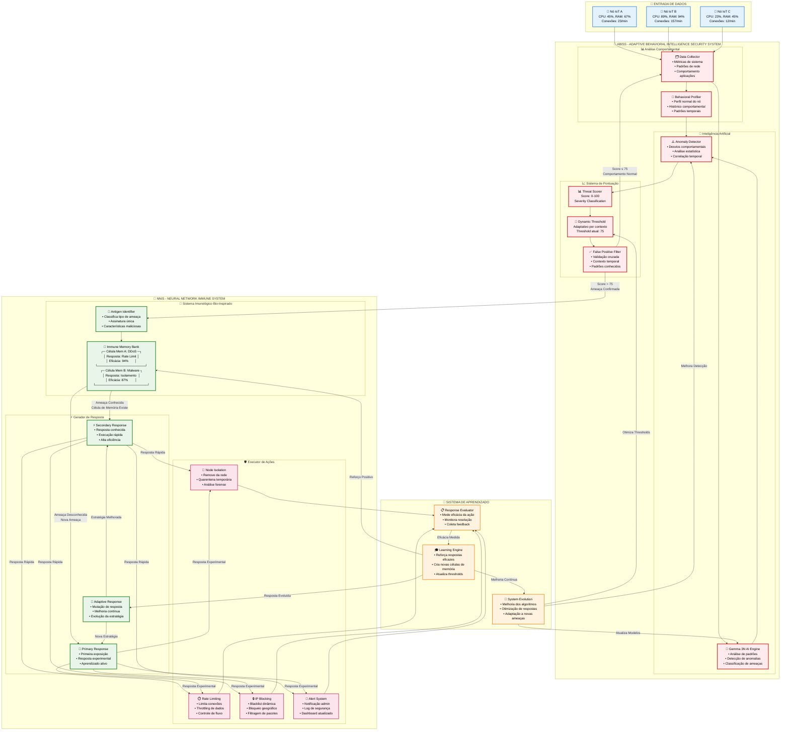

```mermaid
graph TD
    subgraph "📡 ENTRADA DE DADOS"
        IOT1[📱 Nó IoT A<br/>CPU: 45%, RAM: 67%<br/>Conexões: 23/min]
        IOT2[📱 Nó IoT B<br/>CPU: 89%, RAM: 94%<br/>Conexões: 157/min]
        IOT3[📱 Nó IoT C<br/>CPU: 23%, RAM: 45%<br/>Conexões: 12/min]
    end

    subgraph "🧠 ABISS - ADAPTIVE BEHAVIORAL INTELLIGENCE SECURITY SYSTEM"
        subgraph "📊 Análise Comportamental"
            COLLECT[🗂️ Data Collector<br/>• Métricas de sistema<br/>• Padrões de rede<br/>• Comportamento aplicações]
            PROFILE[👤 Behavioral Profiler<br/>• Perfil normal do nó<br/>• Histórico comportamental<br/>• Padrões temporais]
        end
        
        subgraph "🤖 Inteligência Artificial"
            GEMMA[🧠 Gemma 3N AI Engine<br/>• Análise de padrões<br/>• Detecção de anomalias<br/>• Classificação de ameaças]
            ANOMALY[⚠️ Anomaly Detector<br/>• Desvios comportamentais<br/>• Análise estatística<br/>• Correlação temporal]
        end
        
        subgraph "📈 Sistema de Pontuação"
            SCORER[📊 Threat Scorer<br/>Score: 0-100<br/>Severity Classification]
            THRESHOLD[🎯 Dynamic Threshold<br/>Adaptativo por contexto<br/>Threshold atual: 75]
            VALIDATOR[✅ False Positive Filter<br/>• Validação cruzada<br/>• Contexto temporal<br/>• Padrões conhecidos]
        end
    end

    subgraph "🦠 NNIS - NEURAL NETWORK IMMUNE SYSTEM"
        subgraph "🧬 Sistema Imunológico Bio-Inspirado"
            ANTIGEN[🦠 Antigen Identifier<br/>• Classifica tipo de ameaça<br/>• Assinatura única<br/>• Características maliciosas]
            
            MEMORY[🧠 Immune Memory Bank<br/>┌─ Célula Mem A: DDoS ─┐<br/>│ Resposta: Rate Limit │<br/>│ Eficácia: 94%       │<br/>└─────────────────────┘<br/>┌─ Célula Mem B: Malware ┐<br/>│ Resposta: Isolamento  │<br/>│ Eficácia: 87%        │<br/>└───────────────────────┘]
        end
        
        subgraph "⚡ Gerador de Resposta"
            PRIMARY[🔄 Primary Response<br/>• Primeira exposição<br/>• Resposta experimental<br/>• Aprendizado ativo]
            
            SECONDARY[⚡ Secondary Response<br/>• Resposta conhecida<br/>• Execução rápida<br/>• Alta eficiência]
            
            ADAPTIVE[🧬 Adaptive Response<br/>• Mutação de resposta<br/>• Melhoria contínua<br/>• Evolução da estratégia]
        end
        
        subgraph "🛡️ Executor de Ações"
            ISOLATE[🚫 Node Isolation<br/>• Remove da rede<br/>• Quarentena temporária<br/>• Análise forense]
            
            LIMIT[⏱️ Rate Limiting<br/>• Limita conexões<br/>• Throttling de dados<br/>• Controle de fluxo]
            
            BLOCK[🔒 IP Blocking<br/>• Blacklist dinâmica<br/>• Bloqueio geográfico<br/>• Filtragem de pacotes]
            
            ALERT[🚨 Alert System<br/>• Notificação admin<br/>• Log de segurança<br/>• Dashboard atualizado]
        end
    end

    subgraph "🧬 SISTEMA DE APRENDIZADO"
        EVALUATE[📋 Response Evaluator<br/>• Mede eficácia da ação<br/>• Monitora resolução<br/>• Coleta feedback]
        
        LEARNING[🎓 Learning Engine<br/>• Reforça respostas eficazes<br/>• Cria novas células de memória<br/>• Atualiza thresholds]
        
        EVOLUTION[🔄 System Evolution<br/>• Melhoria dos algoritmos<br/>• Otimização de respostas<br/>• Adaptação a novas ameaças]
    end

    %% Fluxo de Dados ABISS
    IOT1 --> COLLECT
    IOT2 --> COLLECT
    IOT3 --> COLLECT
    
    COLLECT --> PROFILE
    COLLECT --> GEMMA
    
    PROFILE --> ANOMALY
    GEMMA --> ANOMALY
    
    ANOMALY --> SCORER
    SCORER --> THRESHOLD
    THRESHOLD --> VALIDATOR

    %% Decisão ABISS → NNIS
    VALIDATOR --> |Score > 75<br/>Ameaça Confirmada| ANTIGEN
    VALIDATOR --> |Score ≤ 75<br/>Comportamento Normal| COLLECT

    %% Fluxo NNIS - Sistema Imunológico
    ANTIGEN --> MEMORY
    
    MEMORY --> |Ameaça Conhecida<br/>Célula de Memória Existe| SECONDARY
    MEMORY --> |Ameaça Desconhecida<br/>Nova Ameaça| PRIMARY
    
    SECONDARY --> |Resposta Rápida| ISOLATE
    SECONDARY --> |Resposta Rápida| LIMIT
    SECONDARY --> |Resposta Rápida| BLOCK
    SECONDARY --> |Resposta Rápida| ALERT
    
    PRIMARY --> |Resposta Experimental| ISOLATE
    PRIMARY --> |Resposta Experimental| LIMIT
    PRIMARY --> |Resposta Experimental| BLOCK
    PRIMARY --> |Resposta Experimental| ALERT
    
    %% Sistema de Aprendizado
    ISOLATE --> EVALUATE
    LIMIT --> EVALUATE
    BLOCK --> EVALUATE
    ALERT --> EVALUATE
    
    EVALUATE --> |Eficácia Medida| LEARNING
    LEARNING --> |Reforço Positivo| MEMORY
    LEARNING --> |Melhoria Contínua| EVOLUTION
    
    %% Feedback Loops
    EVOLUTION --> |Atualiza Modelos| GEMMA
    EVOLUTION --> |Otimiza Thresholds| THRESHOLD
    EVOLUTION --> |Melhora Detecção| ANOMALY
    
    LEARNING --> |Resposta Evoluída| ADAPTIVE
    ADAPTIVE --> |Nova Estratégia| PRIMARY
    ADAPTIVE --> |Estratégia Melhorada| SECONDARY

    %% Estilos Visuais
    classDef input fill:#e3f2fd,stroke:#1976d2,stroke-width:2px,color:#000
    classDef abiss fill:#ffebee,stroke:#d32f2f,stroke-width:3px,color:#000
    classDef nnis fill:#e8f5e8,stroke:#388e3c,stroke-width:3px,color:#000
    classDef learning fill:#fff3e0,stroke:#f57c00,stroke-width:2px,color:#000
    classDef action fill:#fce4ec,stroke:#c2185b,stroke-width:2px,color:#000
    classDef decision fill:#f3e5f5,stroke:#7b1fa2,stroke-width:2px,color:#000

    class IOT1,IOT2,IOT3 input
    class COLLECT,PROFILE,GEMMA,ANOMALY,SCORER,THRESHOLD,VALIDATOR abiss
    class ANTIGEN,MEMORY,PRIMARY,SECONDARY,ADAPTIVE nnis
    class ISOLATE,LIMIT,BLOCK,ALERT action
    class EVALUATE,LEARNING,EVOLUTION learning
```