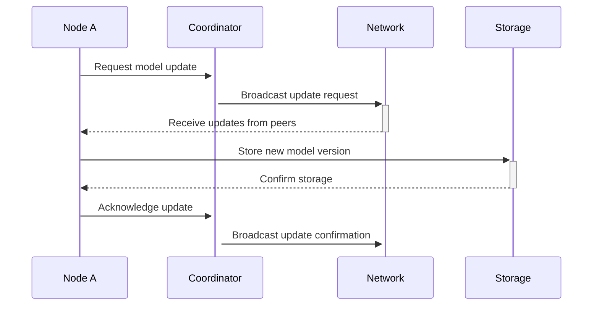

# System Architecture

## Table of Contents

1. [Architectural Overview](#architectural-overview)
2. [Core Components](#core-components)
3. [Data Flow](#data-flow)
4. [Security Model](#security-model)
5. [Scalability](#scalability)
6. [Fault Tolerance](#fault-tolerance)
7. [Performance Considerations](#performance-considerations)
8. [Integration Points](#integration-points)

## Architectural Overview

Atous Secure Network is designed as a distributed system with a modular architecture that enables secure, scalable, and fault-tolerant communication between nodes. The system follows a peer-to-peer (P2P) architecture with federated learning capabilities.

### High-Level Architecture

```
+------------------------------------------------+
|               Atous Secure Network              |
+------------------------------------------------+
|  +----------------+      +------------------+  |
|  |   Core Module  |<---->|  Network Module  |  |
|  +----------------+      +------------------+  |
|         ^                         ^            |
|         v                         v            |
|  +----------------+      +------------------+  |
|  | Security Module|<---->|  Storage Module  |  |
|  +----------------+      +------------------+  |
+------------------------------------------------+
```

## Core Components

### 1. Core Module

Responsible for managing the business logic and orchestration of the system.

#### Key Responsibilities:
- Model lifecycle management
- Version control
- Update distribution
- Resource allocation

#### Main Classes:
- `ModelManager`: Manages model lifecycle and versioning
- `FederatedModelUpdater`: Handles model updates in a federated learning setup
- `ModelMetadata`: Manages model metadata and version history

### 2. Network Module

Handles all network communication between nodes.

#### Key Responsibilities:
- Peer discovery
- Message routing
- Connection management
- Network recovery

#### Main Classes:
- `LoraAdaptiveEngine`: Optimizes LoRa network communication
- `ChurnMitigation`: Manages network partition detection and recovery

### 3. Security Module

Ensures secure communication and data protection.

#### Key Responsibilities:
- Authentication and authorization
- Data encryption
- Threat detection
- Access control

#### Main Classes:
- `ABISSSystem`: Advanced Behavioral and Intrusion Security System
- `ThreatPattern`: Defines and matches threat patterns
- `CryptoManager`: Handles cryptographic operations

### 4. Storage Module

Manages data persistence and retrieval.

#### Key Responsibilities:
- Model storage
- Metadata management
- Caching
- Backup and recovery

#### Main Classes:
- `ModelStorage`: Handles model file storage
- `MetadataStore`: Manages model metadata
- `CacheManager`: Implements caching strategies

## Data Flow

### Model Update Flow



### Network Communication Flow

1. **Discovery Phase**:
   - Nodes broadcast their presence
   - Peers establish secure connections
   - Network topology is built

2. **Synchronization Phase**:
   - Nodes exchange model versions
   - Consensus is reached on the latest version
   - Updates are scheduled if needed

3. **Update Phase**:
   - New models are downloaded
   - Integrity is verified
   - Models are activated

## Security Model

### Authentication

- Mutual TLS for node-to-node communication
- JWT for API authentication
- Certificate-based node identity

### Encryption

- End-to-end encryption for all messages
- AES-256 for data at rest
- TLS 1.3 for data in transit

### Access Control

- Role-based access control (RBAC)
- Fine-grained permissions
- Audit logging for all sensitive operations

## Scalability

### Horizontal Scaling
- Stateless design allows for easy scaling
- Load balancing across multiple instances
- Sharding of model data

### Performance Optimization
- Caching of frequently accessed models
- Delta updates to minimize bandwidth
- Asynchronous processing of non-critical tasks

## Fault Tolerance

### Replication
- Data replication across nodes
- Automatic failover
- Quorum-based consistency

### Recovery
- Automatic detection of node failures
- Self-healing mechanisms
- Point-in-time recovery

## Performance Considerations

### Resource Management
- Memory-efficient model loading
- Background processing of updates
- Connection pooling

### Network Optimization
- Compression of model updates
- Batched updates
- Adaptive retry mechanisms

## Integration Points

### External Systems
- Model repositories
- Monitoring solutions
- Identity providers

### APIs
- REST API for management
- WebSocket for real-time updates
- gRPC for inter-service communication

## Monitoring and Observability

### Metrics
- System metrics (CPU, memory, disk)
- Network metrics (latency, throughput)
- Business metrics (model versions, update frequency)

### Logging
- Structured logging
- Log aggregation
- Alerting on critical events

### Tracing
- Distributed tracing
- Performance analysis
- Dependency mapping
